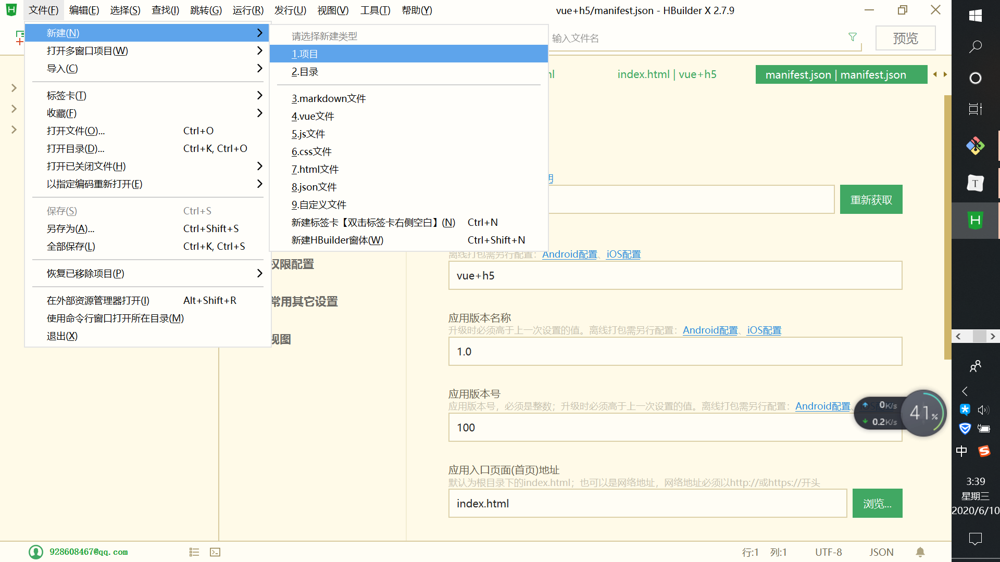
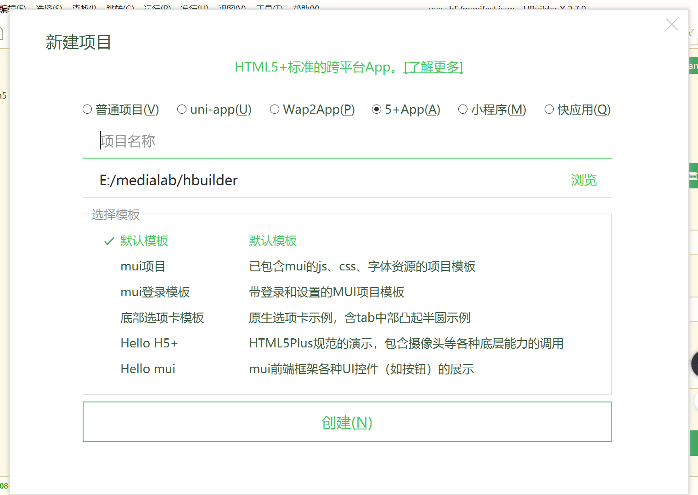
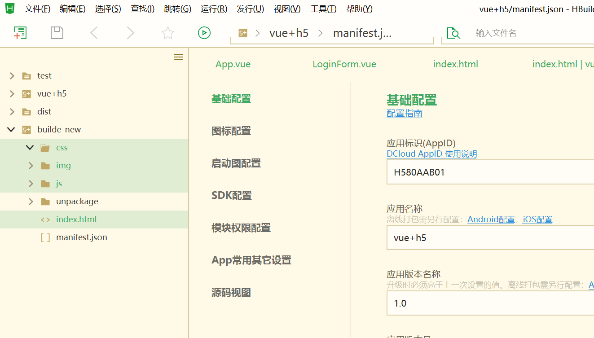
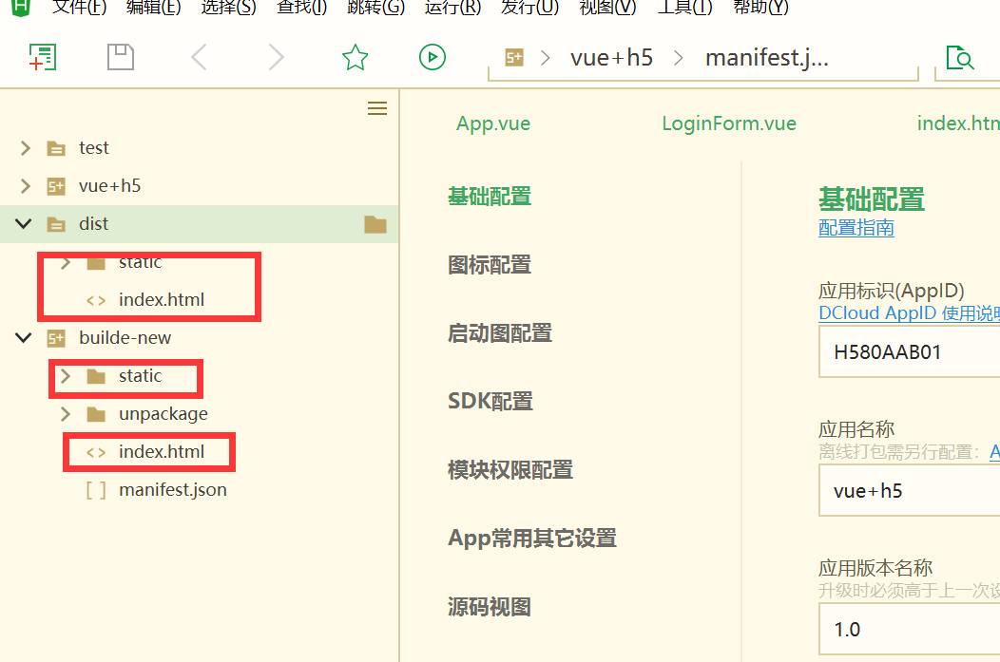
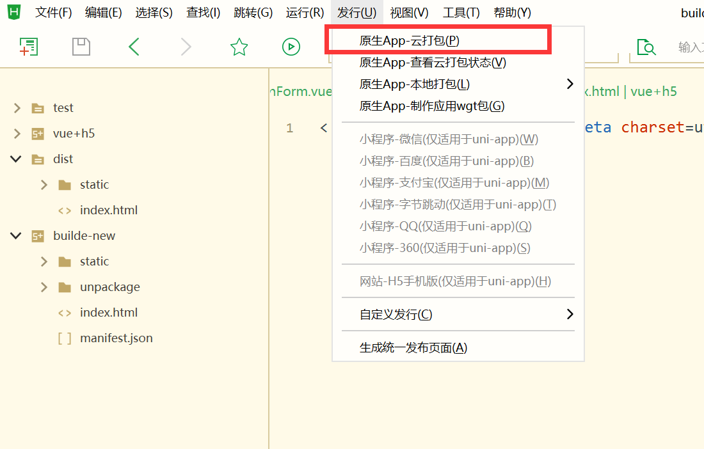
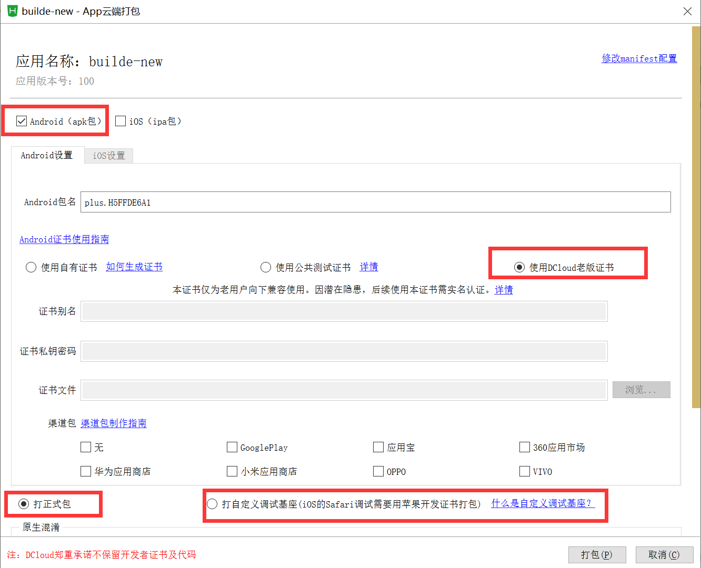
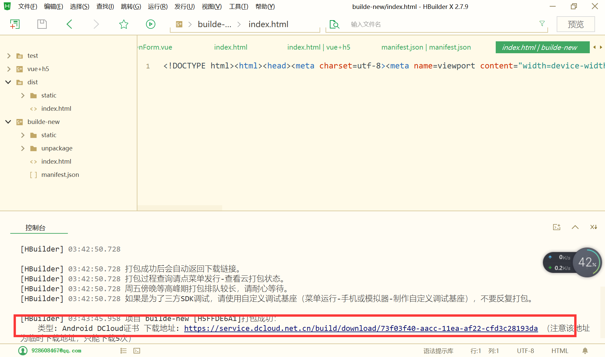

# vuetest

> test

## Build Setup

``` bash
# install dependencies
npm install

# serve with hot reload at localhost:8080
npm run dev

# build for production with minification
npm run build

# build for production and view the bundle analyzer report
npm run build --report
```

For a detailed explanation on how things work, check out the [guide](http://vuejs-templates.github.io/webpack/) and [docs for vue-loader](http://vuejs.github.io/vue-loader).

> 打包
## 把vue项目打包
```
# 在vue目录下
npm run build 
```

1. 新建项目





2. 删除项目的css img js index



3. 把刚才npm run build生成的dist文件里static和index拷贝近新创建的项目
   

4. 点击manifest.json文件然后发行

   
   进行如下配置

5. 下载安装即可
   